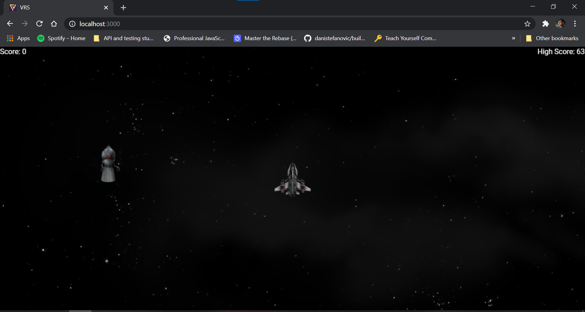

# Shooter game with PIXI.js

It's a fairly simple implementation of the PIXI.js animation library.

Bundled it with webpack, so this repo can even be used as a starter code for any PIXI.js project.



## Controls
On PC 💻


`W OR ↑ : Move ship upwards`  
`A OR ← : Move ship left`  
`S OR ↓ : Move ship down`  
`D OR → : Move ship left`  

`Left Click: Shoot lasers`

`P : Play audio`  
`M : Mute aduio`

On phones 📱

`Drag around the ship.`  
`Click on the screen to shoot lasers`

## Instructions

Each time you hit the enemy:
* Your score increases by 1.
* The enemy speed increases by 1.
* The speed of lasers increases by 0.5

High Score is stored in local storage.

## Using this repo

To run it on you localhost :
```
git clone git@github.com:vaibhavrajsingh2001/arcade-game.git
cd /arcade-game
npm install
npm start
```
Open the game at http://localhost:3000/ then.

To build the production build :
```
npm run clean
npm run build
```
